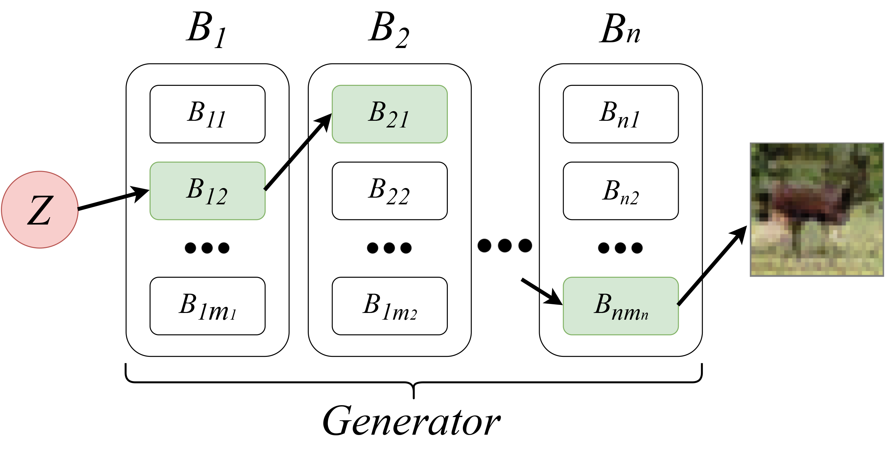
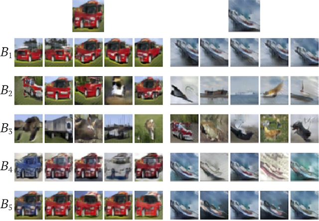
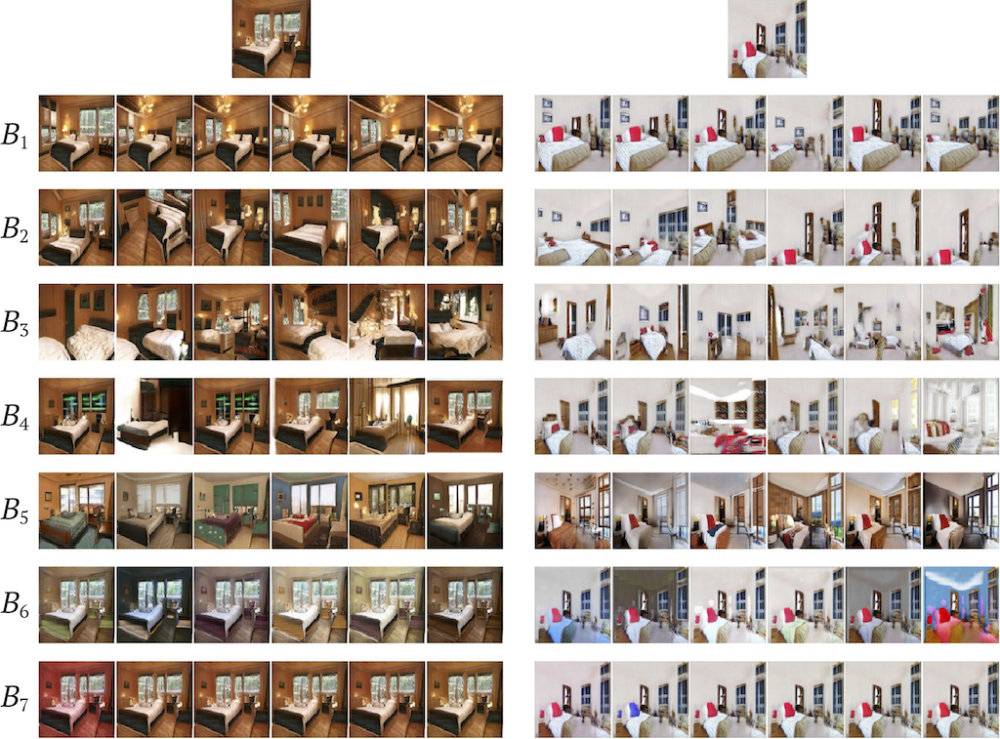

# Random Path GAN (RPGAN)

Original pytorch implementation of preprint _RPGAN: GANs Interpretability via Random Routin_.

RPGAN is an alternative GAN design based on random routes in generator, which can serve as a tool for generative models interpretability.


# How to run?

Go to ```./lib```.
Run train:\
```python train.py --out <out_directory> --model sn_resnet32 --data cifar10 --data_path <path_to_dataset>```

FID computation:\
```python score/scoring.py --dir <train_out_directory>```

To download pretrained models simply run
```download_pretrained.sh```\
This script creates a directory ```./pretrained``` and downloads models and configs for CIFAR-10, AnimeFaces and LSUN-Bedroom.


# How to visualize?

Once you have a RPGAN generator and ```.json``` with its parameters, run

```python visualization.py --model_params <path_to_params.json> --model <path_to_model.pt> --out_dir <out_directory>```

This script generates images charts with layers variations.







# License
Code for FID computation is based on
https://github.com/mseitzer/pytorch-fid

Code for Spectral Norm module is based on
https://github.com/christiancosgrove/pytorch-spectral-normalization-gan
